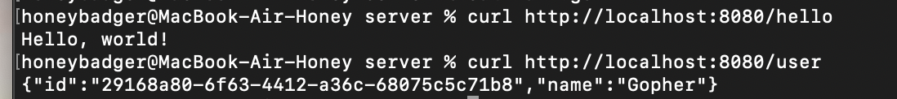
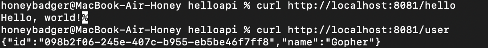
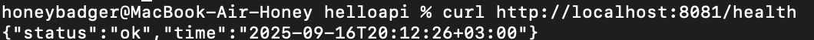

## Практическое занятие №1 Установка и настройка окружения Go.


### Описание проекта

***Простой HTTP-сервер с тремя эндпоинтами:***

 1. `/hello` - возвращает текстовое приветствие

2. `/user` - возвращает JSON с пользователем (генерирует UUID)

3. `/health` - возвращает JSON со статусом сервера и временем
----

***Требования***

1. Go 1.16+

2. Git
------

***Команды запуска/сборки***

1. Установка зависимостей:

    - `go mod tidy`

2. Запуск сервера:
    - `go run ./cmd/server/main.go`
    
    - `APP_PORT=8081 go run ./cmd/server/main.go` *(Запуск на другом порту)*

3. Сборка бинарника и повторная проверка:
    - `go build -o helloapi.exe ./cmd/server`

    - `.\helloapi.exe`
---

***Примеры запросов***

1. Проверка /hello:
    - `curl http://localhost:8080/hello`
    
2. Проверка /user:
    - `curl http://localhost:8080/user`

3. Проверка /health:
    - `curl http://localhost:8080/health`

----

***Структура проекта***

```
helloapi/                 # Основная директория проекта Go
├── cmd/
│   └── server/
│       └── main.go      # Основной файл сервера
├── go.mod               # Файл модуля Go
├── go.sum               # Файл checksum зависимостей
└── helloapi.exe         # Сборка бинарника

photos/                  # Директория для фото
└── ...                  # Файлы фото

README.md                # Файл README
```
---

### Отчётные материалы

1. **go version**


2. **Порт 8080 `hello`,`id`**




3. **Порт 8081 `hello`, `id`**




4. **Доп. звёздочка: добавить /health c JSON { "status":"ok", "time":"<RFC3339>**



