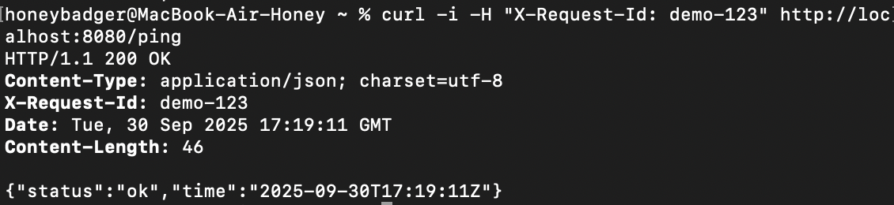

## Практическое занятие №2 Структура Go-проекта

### 1. Структура проекта

002-practice/
├── bin/
│   └── myapp                 # Собранный бинарник
├── cmd/
│   └── myapp/
│       └── main.go           # Точка входа приложения
├── internal/
│   └── app/
│       ├── handlers/
│       │   └── ping.go       # Обработчики HTTP-запросов
│       └── app.go            # Основная логика приложения
├── utils/
│   ├── httpjson.go           # Утилиты для JSON ответов
│   └── logger.go             # Логирование
├── go.mod                    # Модуль Go
photos/                       # Директория для фото
└── ...                       # Файлы фото
└── README.md                 # Документация

### Как запустить

**Требования**
- Go 1.16+
- Git

**Запуск в development**
bash
`go run ./cmd/myapp`

**Фото материалы**

1. Скрин структуры проекта:

2. Скрин запуска сервера и логов в терминале (после обращений к / и /ping).

    - Запуск
    

3. Скрин/вывод curl -i `http://localhost:8080/ping` (видно JSON и заголовки).

    - Вывод команды `curl -i http://localhost:8080/ping`
    

4. **Упражнение А** — скрин curl -i -H "X-Request-Id: demo-123" ... и заголовка в ответе.

    - Вывод команды `curl -i -H "X-Request-Id: demo-123" http://localhost:8080/ping`

    

5. **Упражнение B** Единый формат JSON-ошибок

    -Вывод команды `curl -i http://localhost:8080/fail`

    

6. **Упражнение C** Разделение обработчиков

    - Создан пакет для хендлеров
    [internal/app/handlers/ping.go](./internal/app/handlers/ping.go)

    - Подправлена регистрация app.go
    [internal/app.go](./interal/app.go)

    

