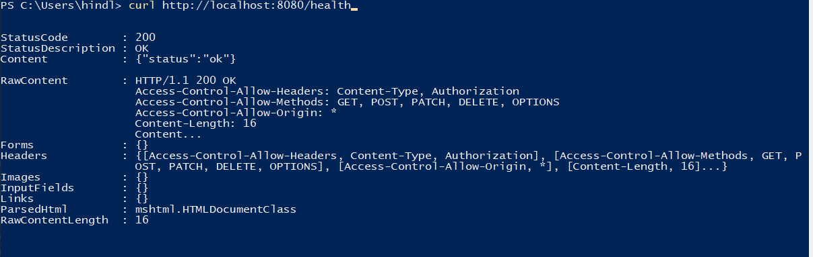
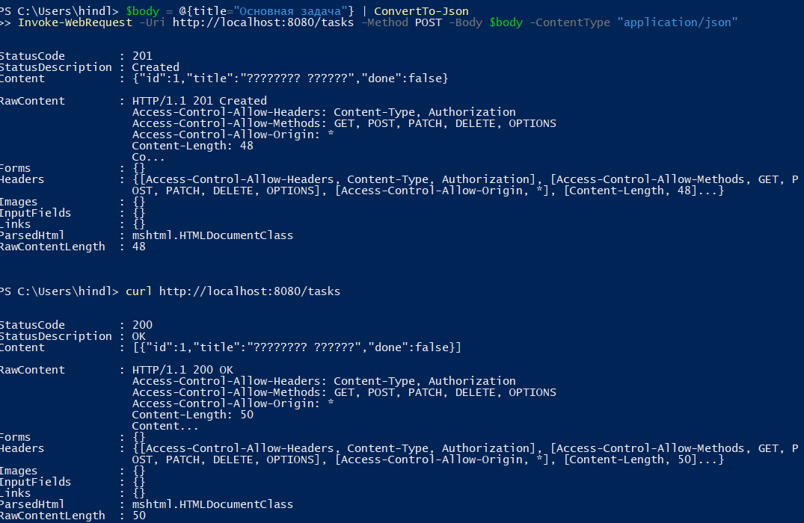
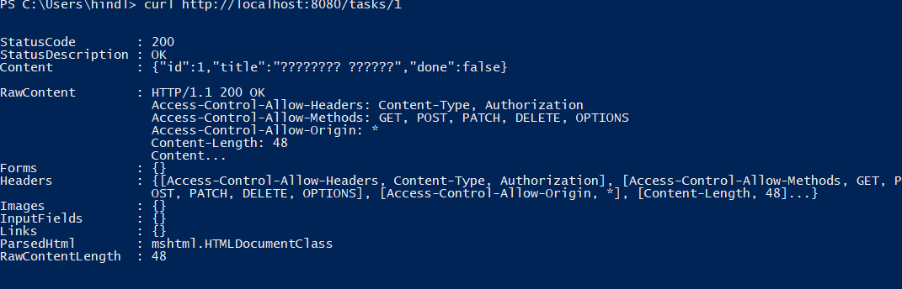

## Практическое занятие №3 Реализация простого HTTP-сервера на стандартной библиотеке net/http. Обработка запросов GET/POST

### ФИО: Мальцев Никита Михайлович
### Группа: ЭФМО 02-25

### 1. Структура проекта

```
003-practice/
│   README.md
│   temp.json
│
├───photos                          #Дериктория для фото
└───pz3-http                        #Основной проект
    │   go.mod                      #Модуль Go
    │
    ├───cmd
    │           main.go             #Точка для входа приложения
    │
    └───internal
        ├───api
        │       handlers.go         # Обработчики HTTP запросов
        │       handlers_test.go    # Юнит-тесты
        │       middleware.go       # Middleware (CORS, логирование)
        │       responses.go        # Вспомогательные функции ответов
        │
        └───storage
                memory.go            # In-memory хранилище задач
```

1. Health check



2. Создание и просмотр задач



3. Получение задачи по `ID`



### Функциональность

- `GET /health` - проверка работоспособности сервера

- `GET /tasks` - список всех задач (с фильтрацией ?q=)

- `POST /tasks` - создание новой задачи

- `GET /tasks/{id}` - получение задачи по ID

- `PATCH /tasks/{id}` - обновление задачи

- `DELETE /tasks/{id}` - удаление задачи

### Дополнительно

1. `CORS (минимально)`: добавить заголовки Access-Control-Allow-Origin: * для GET/POST (в отдельной middleware).


2. Валидация длины `title` (например, 1…140 символов).


3. Метод `PATCH /tasks/{id}`для отметки Done=true.


4. Метод `DELETE /tasks/{id}`

    - Задача для удаления \ проверка

    

    - Удаление задачи \ проверка

    

5. `Graceful shutdown` через http.Server и контекст.


6. `Юнит-тесты` обработчиков с `httptest`

