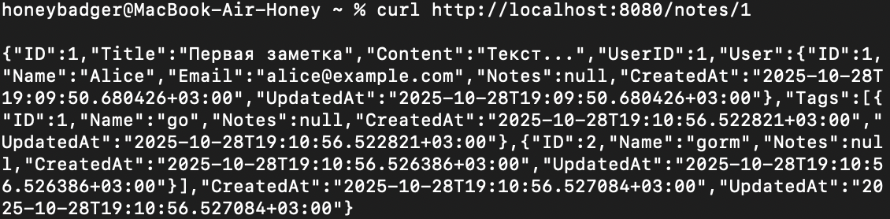

## Практическое занятие №6 Использование ORM (GORM). Модели, миграции и связи между таблицами.

### ФИО: Мальцев Никита Михайлович
### Группа: ЭФМО 02-25

### Требования к отчёту

#### 1. Краткое описание, зачем ORM и чем помог GORM (3–5 предложений).

- `ORM (Object-Relational Mapping)` позволяет работать с базой данных через объекты и структуры вместо прямого написания SQL-запросов. `GORM` значительно ускорил разработку: автоматические миграции создали все таблицы и связи на основе Go-структур, встроенные методы для CRUD-операций сократили объем кода, а Preload упростил загрузку связанных данных. Особенно удобно работали связи M:N через теги `gorm:"many2many"` - GORM автоматически создал промежуточную таблицу и управляет ею.

#### 2. Скриншоты

- **Создание пользователя**


- **Создание заметки**


- **Получение заметки**



- **Схема БД `ERD`**


### 3. Ссылка на репозиторий (минимум: go.mod, исходники, README с примером DB_DSN).

- [Ссылка на практику 6](https://github.com/hindlebe/GO/tree/main/006-practice)

- **Запуск проекта**:

```bash
export DB_DSN="host=localhost user=postgres password=YOUR_PASSWROD dbname=pz6_gorm port=5432 sslmode=disable"
go run ./cmd/server
```

### 4. Пара строк о проблемах и как вы их решили

При проверке и запуске терминал сообщал об неиспользуемых зависимостях в `go.mod` - при первом запуске AutoMigrate автоматически создал все таблицы и связи, включая промежуточную таблицу note_tags для связи M:N.