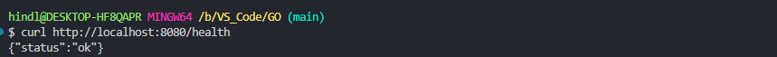
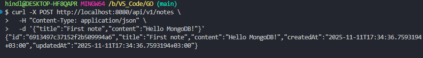
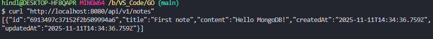
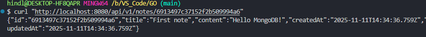
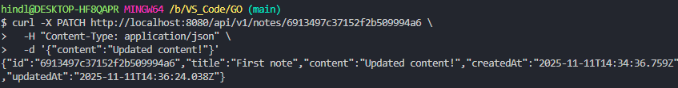
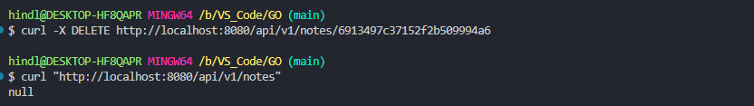

## Практическое занятие №8 Работа с MongoDB: подключение, создание коллекции, CRUD-операции

### ФИО: Мальцев Никита Михайлович
### Группа: ЭФМО 02-25

### Требования к отчёту

**Окружение**

- Go: go version go1.25.3 windows/amd64

- MongoDB: запущена через Docker Compose (образ mongo:7)

- Docker: Docker Desktop (Docker version 28.5.1, build e180ab8)

- Драйвер MongoDB: go.mongodb.org/mongo-driver v1.17.6

- ОС: Windows 11 (с использованием WSL2 - MINGW64_NT-10.0-19045)

- Git: git version 2.51.0.windows.1


**Запуск проекта**

- Запустить MongoDB: 
В корне проекта `008-practice` выполнить:

```bash
docker compose up -d
```

- В корне проекта `008-practice` выполнить:
```bash
go run ./cmd/api
```

**Запросы**

- `HEALTH`

```bash
curl http://localhost:8080/health
```

- `POST` создание заметки

```bash
curl -X POST http://localhost:8080/api/v1/notes \
  -H "Content-Type: application/json" \
  -d '{"title":"ЗАМЕТКА","content":"ТЕКСТ"}'
```

-  `NOTES` получение всех заметок по эндпоинту

```bash
curl "http://localhost:8080/api/v1/notes"
```

- `NOTES<ID>` получение заметки по ID эндпоинту ({id} - заменить на реальный ID)

```bash
curl "http://localhost:8080/api/v1/notes/{id}"

```

- `PATCH` частичное обновление (можно обновлять либо оба поля: title/content, либо только одно)

```bash
curl -X PATCH http://localhost:8080/api/v1/notes/{id} \
  -H "Content-Type: application/json" \
  -d '{"content":"НОВЫЙ ТЕКСТ"}'
```

- `DELETE` удаление отметки по ID

```bash
curl -X DELETE http://localhost:8080/api/v1/notes/{id}
```


**Структура**

```
008-practice/
├── cmd/api/main.go
├── internal/db/mongo.go
├── internal/notes/
│   ├── model.go
│   ├── repo.go
│   └── handler.go
├── photos/
├── .env.example
├── docker-compose.yml
├── go.mod
├── go.sum
└── README.md
```

**Скришноты**

`HEALTH`



`POST`



`NOTES`



`NOTES/<ID>`



`PATCH`



`NOTES ENDPOINT AFTER PATCH`


`DELETE`




